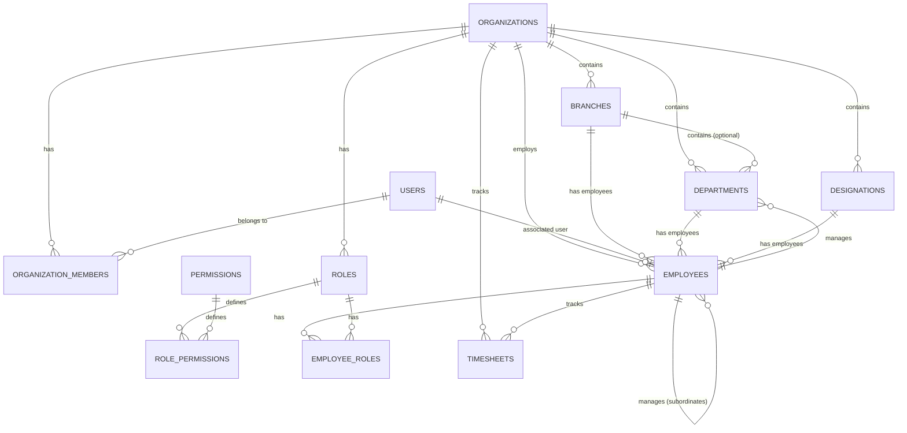

# Database Schema Documentation

This document describes the relational database schema design for the core organization and people domains in the Workforce ERP.

## Entity Relationship Diagram

---

## Tables

### 1. `organizations` (Tenants)

Represents the organizational tenants. All records belonging to a tenant reference this table's primary key.

| Column       | Type      | Constraints                 | Description                            |
| ------------ | --------- | --------------------------- | -------------------------------------- |
| `id`         | bigint    | Auto-Increment, Primary Key | Unique ID                              |
| `name`       | string    | Not Null                    | Display name of the tenant             |
| `slug`       | string    | Unique, Index               | URL-friendly identifier                |
| `subdomain`  | string    | Unique, Nullable, Index     | Optional custom subdomain              |
| `status`     | string    | Default: 'active'           | Tenant status (e.g. active, suspended) |
| `created_at` | timestamp | Nullable                    | Creation timestamp                     |
| `updated_at` | timestamp | Nullable                    | Update timestamp                       |
| `deleted_at` | timestamp | Nullable                    | Soft delete timestamp                  |

### 2. `organization_members`

A join table representing users who are members of one or more organizations.

| Column            | Type      | Constraints                                      | Description                                 |
| ----------------- | --------- | ------------------------------------------------ | ------------------------------------------- |
| `id`              | bigint    | Auto-Increment, Primary Key                      | Unique ID                                   |
| `organization_id` | bigint    | Foreign Key (organizations.id) ON DELETE CASCADE | Tenant reference                            |
| `user_id`         | bigint    | Foreign Key (users.id) ON DELETE CASCADE         | Login account reference                     |
| `role`            | string    | Default: 'member'                                | Membership role (e.g. owner, admin, member) |
| `status`          | string    | Default: 'active'                                | Membership status                           |
| `created_at`      | timestamp | Nullable                                         | Creation timestamp                          |
| `updated_at`      | timestamp | Nullable                                         | Update timestamp                            |

**Indexes / Constraints:**

- Unique Index: `['organization_id', 'user_id']`

### 3. `branches`

Represents physical locations of an organization.

| Column            | Type      | Constraints                                      | Description                  |
| ----------------- | --------- | ------------------------------------------------ | ---------------------------- |
| `id`              | bigint    | Auto-Increment, Primary Key                      | Unique ID                    |
| `organization_id` | bigint    | Foreign Key (organizations.id) ON DELETE CASCADE | Tenant reference             |
| `name`            | string    | Not Null                                         | Branch name                  |
| `code`            | string    | Nullable                                         | Short branch identifier code |
| `address`         | text      | Nullable                                         | Branch address               |
| `is_active`       | boolean   | Default: true                                    | Status flag                  |
| `created_at`      | timestamp | Nullable                                         | Creation timestamp           |
| `updated_at`      | timestamp | Nullable                                         | Update timestamp             |
| `deleted_at`      | timestamp | Nullable                                         | Soft delete timestamp        |

**Indexes / Constraints:**

- Unique Index: `['organization_id', 'name']`

### 4. `departments`

Represents operational groups within an organization.

| Column            | Type      | Constraints                                             | Description               |
| ----------------- | --------- | ------------------------------------------------------- | ------------------------- |
| `id`              | bigint    | Auto-Increment, Primary Key                             | Unique ID                 |
| `organization_id` | bigint    | Foreign Key (organizations.id) ON DELETE CASCADE        | Tenant reference          |
| `branch_id`       | bigint    | Foreign Key (branches.id) ON DELETE SET NULL, Nullable  | Branch location reference |
| `name`            | string    | Not Null                                                | Department name           |
| `code`            | string    | Nullable                                                | Short department code     |
| `manager_id`      | bigint    | Foreign Key (employees.id) ON DELETE SET NULL, Nullable | Department head reference |
| `is_active`       | boolean   | Default: true                                           | Status flag               |
| `created_at`      | timestamp | Nullable                                                | Creation timestamp        |
| `updated_at`      | timestamp | Nullable                                                | Update timestamp          |
| `deleted_at`      | timestamp | Nullable                                                | Soft delete timestamp     |

**Indexes / Constraints:**

- Unique Index: `['organization_id', 'name']`

### 5. `designations`

Represents job titles within an organization.

| Column            | Type      | Constraints                                      | Description            |
| ----------------- | --------- | ------------------------------------------------ | ---------------------- |
| `id`              | bigint    | Auto-Increment, Primary Key                      | Unique ID              |
| `organization_id` | bigint    | Foreign Key (organizations.id) ON DELETE CASCADE | Tenant reference       |
| `name`            | string    | Not Null                                         | Designation name       |
| `code`            | string    | Nullable                                         | Short designation code |
| `description`     | text      | Nullable                                         | Job role description   |
| `is_active`       | boolean   | Default: true                                    | Status flag            |
| `created_at`      | timestamp | Nullable                                         | Creation timestamp     |
| `updated_at`      | timestamp | Nullable                                         | Update timestamp       |
| `deleted_at`      | timestamp | Nullable                                         | Soft delete timestamp  |

**Indexes / Constraints:**

- Unique Index: `['organization_id', 'name']`

### 6. `employees`

Represents staff members inside an organization. An employee is distinct from a User; they may optionally have a user account linked for login credentials.

| Column             | Type      | Constraints                                                | Description                                         |
| ------------------ | --------- | ---------------------------------------------------------- | --------------------------------------------------- |
| `id`               | bigint    | Auto-Increment, Primary Key                                | Unique ID                                           |
| `organization_id`  | bigint    | Foreign Key (organizations.id) ON DELETE CASCADE           | Tenant reference                                    |
| `user_id`          | bigint    | Foreign Key (users.id) ON DELETE SET NULL, Nullable        | Login account link                                  |
| `branch_id`        | bigint    | Foreign Key (branches.id) ON DELETE SET NULL, Nullable     | Location assignment                                 |
| `department_id`    | bigint    | Foreign Key (departments.id) ON DELETE SET NULL, Nullable  | Department assignment                               |
| `designation_id`   | bigint    | Foreign Key (designations.id) ON DELETE SET NULL, Nullable | Job title assignment                                |
| `manager_id`       | bigint    | Foreign Key (employees.id) ON DELETE SET NULL, Nullable    | Supervisor reference                                |
| `employee_id`      | string    | Not Null                                                   | Staff ID card number                                |
| `first_name`       | string    | Not Null                                                   | First name                                          |
| `last_name`        | string    | Not Null                                                   | Last name                                           |
| `email`            | string    | Not Null                                                   | Contact email                                       |
| `phone`            | string    | Nullable                                                   | Contact phone number                                |
| `hire_date`        | date      | Not Null                                                   | Hiring date                                         |
| `termination_date` | date      | Nullable                                                   | Resignation/termination date                        |
| `status`           | string    | Default: 'active'                                          | employment status (e.g. active, on-leave, inactive) |
| `employment_type`  | string    | Default: 'full-time'                                       | Type (e.g. full-time, part-time, contractor)        |
| `created_at`       | timestamp | Nullable                                                   | Creation timestamp                                  |
| `updated_at`       | timestamp | Nullable                                                   | Update timestamp                                    |
| `deleted_at`       | timestamp | Nullable                                                   | Soft delete timestamp                               |

**Indexes / Constraints:**

- Unique Index: `['organization_id', 'employee_id']`
- Unique Index: `['organization_id', 'email']`

### 7. Roles & Permissions

#### `roles`

| Column            | Type      | Constraints                                      | Description                |
| ----------------- | --------- | ------------------------------------------------ | -------------------------- |
| `id`              | bigint    | Auto-Increment, Primary Key                      | Unique ID                  |
| `organization_id` | bigint    | Foreign Key (organizations.id) ON DELETE CASCADE | Tenant reference           |
| `name`            | string    | Not Null                                         | Role identifier            |
| `description`     | string    | Nullable                                         | Description of role duties |
| `created_at`      | timestamp | Nullable                                         | Creation timestamp         |
| `updated_at`      | timestamp | Nullable                                         | Update timestamp           |

- Unique Index: `['organization_id', 'name']`

#### `permissions`

Global permissions registry.

| Column        | Type      | Constraints                 | Description                                     |
| ------------- | --------- | --------------------------- | ----------------------------------------------- |
| `id`          | bigint    | Auto-Increment, Primary Key | Unique ID                                       |
| `name`        | string    | Unique, Not Null            | System permission tag (e.g. `employees.create`) |
| `description` | string    | Nullable                    | Description of privilege                        |
| `created_at`  | timestamp | Nullable                    | Creation timestamp                              |
| `updated_at`  | timestamp | Nullable                    | Update timestamp                                |

#### `role_permissions`

| Column          | Type   | Constraints                                    | Description          |
| --------------- | ------ | ---------------------------------------------- | -------------------- |
| `role_id`       | bigint | Foreign Key (roles.id) ON DELETE CASCADE       | Role reference       |
| `permission_id` | bigint | Foreign Key (permissions.id) ON DELETE CASCADE | Permission reference |

- Primary Key: `['role_id', 'permission_id']`

#### `employee_roles`

| Column        | Type   | Constraints                                  | Description        |
| ------------- | ------ | -------------------------------------------- | ------------------ |
| `employee_id` | bigint | Foreign Key (employees.id) ON DELETE CASCADE | Employee reference |
| `role_id`     | bigint | Foreign Key (roles.id) ON DELETE CASCADE     | Role reference     |

- Primary Key: `['employee_id', 'role_id']`

### 8. `timesheets`

Tracks work hours and presence logs.

| Column            | Type         | Constraints                                      | Description                             |
| ----------------- | ------------ | ------------------------------------------------ | --------------------------------------- |
| `id`              | bigint       | Auto-Increment, Primary Key                      | Unique ID                               |
| `organization_id` | bigint       | Foreign Key (organizations.id) ON DELETE CASCADE | Tenant reference                        |
| `employee_id`     | bigint       | Foreign Key (employees.id) ON DELETE CASCADE     | Worker reference                        |
| `date`            | date         | Not Null                                         | Shift date                              |
| `clock_in`        | datetime     | Nullable                                         | Clock-in timestamp                      |
| `clock_out`       | datetime     | Nullable                                         | Clock-out timestamp                     |
| `total_hours`     | decimal(8,2) | Default: 0                                       | Total hours elapsed                     |
| `status`          | string       | Default: 'present'                               | Status (e.g. present, absent, on-leave) |
| `created_at`      | timestamp    | Nullable                                         | Creation timestamp                      |
| `updated_at`      | timestamp    | Nullable                                         | Update timestamp                        |

**Indexes / Constraints:**

- Unique Index: `['employee_id', 'date']`
- Index on: `['organization_id', 'date']`
